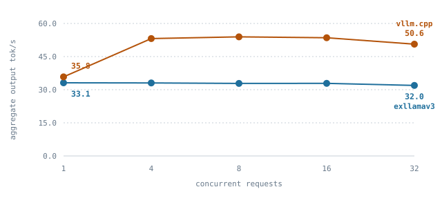
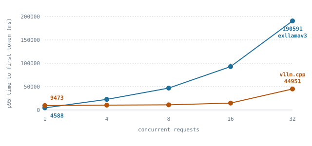

# `qwen38-27b-exl3-variadic-gb10` — Qwen3.8-27B EXL3 under a mixed-length serving load

Their engine and ours, on one GB10 board, behind one client, over a prompt-length
distribution that spans short questions to long code reviews, swept over
concurrency, reported as percentiles.

Its method is [`variadic-load-methodology`](variadic-load-methodology.md). Read
that before you quote anything here. Its predecessor is
[`qwen38-27b-exl3-gb10`](qwen38-27b-exl3-gb10.md), which measured one prompt band
at concurrency 1 and published means; nothing on this page supersedes its
ratios, because the two pages measure different loads.

## Disposition

**Measured.** Between 5 and 10 September 2026 one client drove both engines on
one GB10 board over a mixed prompt-length corpus at concurrency 1, 4, 8, 16
and 32. Every cell has two rounds, in different boots, and the spread is
published beside every value.

Three results, warm only, warmup discarded:

- **Their aggregate throughput does not move with concurrency and ours does.**
  33.12, 33.05, 32.84, 32.88, 31.95 output tok/s at c = 1, 4, 8, 16 and 32
  against our 35.81, 53.17, 53.93, 53.53, 50.62. Thirty-two times the offered
  load buys them nothing and buys us 41% over our single-stream rate. At
  c = 16 and 32 the ratio is 1.63x and 1.58x.
- **We prefill long prompts about half as fast as they do**, and the gap widens
  with prompt length. This is the finding the predecessor's 93-to-457-token
  workload could not produce. The gap is a c = 1 phenomenon; at c = 16 and 32
  it is buried under their queue time.
- **Both engines now report acceptance**, for the first time in this comparison:
  0.789 to 0.799 accepted draft tokens per output token on our side against
  0.773 to 0.778 on theirs.

**These legs ran the SHIPPED paged draft route.** Every previously published
number on the predecessor page ran `VT_DFLASH_PAGED=0`, because that route
faulted eagerly until `42b309508` closed
[#2274](https://github.com/mudler/vllm.cpp/issues/2274). This is the first
measurement of the default configuration, so **no number here is directly
comparable to a number on that page** — a different code path served it.

## Two things that are true of every number here

**No correctness gate covers this run, and none can.** Both engines sample at
`T = 0.6`, so the two token streams are not expected to match and a token-exact
comparison cannot run on them. Nothing scores the text either engine writes.

**The comparator serializes generation.** `tools/serve_openai.py:45` creates
`gen_lock` and line 315 holds it around the entire `generator.iterate()` loop.
Their own docstring at line 18 says "requests are serialized (batch-1 draft);
concurrent callers queue." Above concurrency 1 their figures measure queueing and
ours measure batching, and the flat throughput row above is that lock. A ratio at
c = 8 is a serving result and not a kernel result.

## Subject

| | |
|---|---|
| target | `Mia-AiLab/Qwen3.8-27B-EXL3-3.5bpw` @ `19441ac874c4018295da848e250f23511361cda4` |
| draft | `Mia-AiLab/Qwen3.8-27B-DFlash2-EXL3-5.0bpw` @ `4f0436269bca761b071f05319e8e04a87cc633f9` |
| device | NVIDIA GB10, compute capability 12.1, driver 580.173.02, nvcc 13.0, `sm_121a`, kernel 6.17.0-1029-nvidia |
| tree | `3351ec54f375c6934246520cac112a10d2fbee07` (all legs); binary rebuilt per boot, md5s in `results.txt` (the DGX crashed under load and each resubmission rebuilt) |
| comparator engine | `MiaAI-Lab/exllamav3` @ `63b32f001d7b2cfed3b3e3aaf25f534ba53cc7ed`, tarball sha256 `18b49d64e6a171bcbfd06bd02f139fc53189e04b5ff8f510a3afbd622dd372d4`, wheel sha256 `a24b224a7e143a5deb0e16c29c06ff7d3182ce3a831164e00adc376514c8dd7a` |
| host | `dgx:gpu0`, multiple `rc` leases across nine boots (DGX crashed under load); c = 1-8 on boot `89be3474`, c = 16-32 on boots `3fcc8169` and `a94c4f5c`; lease ids in `results.txt` |
| our recipe | `--max-model-len 8192 --max-num-batched-tokens 16384 --no-enable-prefix-caching --enable-metrics --enable-thinking`, `dflash` at `num_speculative_tokens: 7`, **paged draft route ON (the shipped default)**. c = 1-8 ran `--max-num-seqs 8 --num-blocks 2048`; c = 16-32 ran `--max-num-seqs 32 --num-blocks 8192`. At c <= 8 the two configurations behave identically: the pool is larger but unused |
| their recipe | `-cq nvfp4 -cs 262144`, verbatim from their card |

`G-BYTES PASS`: all three checkpoint shard sha256 values were recomputed **on the
device** and matched the pins
(`7b77214f…`, `411c83bb…`, `6b2e3afc…`).

`G-RESOLVED PASS`: the server reported `max_num_seqs=8` resolved against a
2048-block KV pool on the c = 1-8 boots, and `max_num_seqs=32` resolved
against an 8192-block pool on the c = 16-32 boots, so no leg ran below its rung.

The startup line also reports a term `gpu_memory_utilization` does not bound:
1282.5 MiB of draft speculative context at `max_num_seqs 8` (5130 MiB at
`max_num_seqs 32`), 160.312 MiB per concurrent request. That is
[#2993](https://github.com/mudler/vllm.cpp/issues/2993). This run pinned
`--num-blocks` explicitly so the ladder would not measure it as noise.

## The load

Four length bands from three corpora, each pinned by sha256:

| Band | Share | Source | sha256 |
|---|---|---|---|
| `S` short question | 35% | GSM8K `test.jsonl` | `3730d312f6e3440559ace48831e51066acaca737f6eabec99bccb9e4b3c39d14` |
| `M` code completion | 40% | HumanEval `HumanEval.jsonl` | `1d49078ba3e2b196b9344535bef34a43021f038fad9561d6ee7c53450609a6a2` |
| `L` prose summary | 15% | vLLM `benchmarks/sonnet.txt` | `d58663195ba6780da5f029b920c7ac00cad1e435ee1df7e03bf9ec2470f8dea4` |
| `XL` long code review | 10% | HumanEval `HumanEval.jsonl` | as above |

`M` is the predecessor's whole workload, kept so the two pages share one band.

The corpus is built by `benchmarks/variadic/build_corpus.py` from those bytes,
that seed and those weights, and nothing else. The realised token-length
histogram is read back from each server's own `usage.prompt_tokens`.

Matched on both sides: the box, the client, the corpus, `max_tokens: 192`,
`temperature: 0.6`, `top_p: 0.95`, `top_k: 20`, `seed: 0`, the chat endpoint,
each model's own chat template, thinking enabled, and no `ignore_eos`.

Concurrency rungs 1, 4, 8, 16 and 32. Two rounds. Round 2 reverses both the arm order
and the rung order, so a monotone drift over the session appears as a rung-to-rung
disagreement between the rounds rather than as a shape in the sweep.

The c = 1-8 legs used a 144-prompt corpus (sha256 `6d6420fc...`); the c = 16-32
legs used a 192-prompt superset (sha256 `b52ef36c...`). The first 144 prompts are
identical (deterministic seed), so the measured 128 requests are the same prompts
at every rung below 32. At c = 32 the warmup is 32, so 16 prompts that were warmup
at lower rungs enter the measured window; they are from the same bands and the
distribution does not shift.

Warmup is `max(C, 4)` requests, run to completion before the measured window
opens, and recorded rather than discarded, so both views come from one set of
records.

## The percentile method, applied to the predecessor's own records

`benchmarks/variadic/adapt_headtohead.py` converts the four legs of
[`qwen38-27b-exl3-gb10`](qwen38-27b-exl3-gb10.md) into the record shape
`report.py` reads. The field definitions already agreed: `ttft` is the wall time
to the first content-carrying chunk, `itl` is a gap between streamed chunks,
`latency` is client-side, and the token counts come from each server's `usage`.
Request `i = 0` is tagged as warmup, which is that page's own stated rule and the
one its head-to-head legs did not apply.

**The percentile tables that came out of it are published on that page**, under
[time to first token](qwen38-27b-exl3-gb10.md#time-to-first-token), and they are
not repeated here. In short: its mean-TTFT conclusion held at the median and
reversed above p90, and one request out of 164 was most of the difference.

Two readings from the same conversion are not on that page.

### Inter-token latency measures the same thing on both sides once the chunking is removed

| arm | tokens per chunk | itl p50 ms | itl mean ms | itl mean / tokens per chunk | tpot mean ms |
|---|---|---|---|---|---|
| ours | 4.47 | 82.2 | 82.3 | 18.4 | 18.6 |
| theirs | 1.08 | 0.0 | 24.0 | 22.3 | 22.3 |

Their p50 inter-token latency is 0.0 ms. That is not a fast engine; it is a
server wrapper that holds back 16 characters
(`tools/serve_openai.py:74`) and then releases several chunks with no gap
between them. Ours is 82.2 ms because one chunk carries 4.47 tokens.

Divide each engine's mean chunk gap by its own tokens per chunk and both land on
that engine's mean time per output token, 18.4 against 18.6 and 22.3 against
22.3. That is why this harness reports time per output token as the primary
inter-token axis and prints the chunk statistics beside the raw gaps.

### A bound on what the chunking costs our time to first token

The harness's own correction needs the first chunk's character count, which the
predecessor's client did not record, so `report.py` prints that column as absent
for these legs. A weaker correction is available from what the files hold, and
it is a **bound, not the harness's estimate**: subtract
`(mean tokens per chunk - 1) x mean time per output token`, which is 64.5 ms from
ours and 1.7 ms from theirs. It assumes the first chunk carries that engine's
average number of tokens, which the harness does not assume.

| percentile | ours raw ms | ours bounded ms | theirs raw ms | theirs bounded ms |
|---|---|---|---|---|
| p50 | 863.1 | 798.5 | 762.7 | 761.0 |
| p90 | 1219.0 | 1154.4 | 1739.2 | 1737.5 |
| p95 | 1371.6 | 1307.0 | 1959.9 | 1958.2 |
| p99 | 1535.8 | 1471.2 | 2850.8 | 2849.0 |

Chunking accounts for about two thirds of their median lead and none of our tail
lead. Their median advantage survives the correction, at 5% rather than the 12%
the raw figures show.

**The bound does not neutralise their hold-back, and should not be read as
doing so.** Their wrapper emits `pending[:len(pending) - HOLD_BACK]`, so its
first chunk contains the text minus the 16 characters that caused the delay. The
correction removes a chunk SIZE from both engines. It does not restore the time
either engine spent before its first chunk left the server.

### What this section does not do

It adds no samples, runs no engine and changes no configuration. Every unmatched
axis and every limitation carries over from the predecessor page unchanged.

## Realised prompt-length histogram

**Read back from each server's own `usage.prompt_tokens`**, over the measured
requests of every leg. Each engine renders its own chat template, and both
rendered the corpus to the same counts.

| band | n | min | p50 | p90 | max | mean |
|---|---|---|---|---|---|---|
| `S` short question | 842 | 78 | 108 | 139 | 160 | 110 |
| `M` code completion | 1067 | 93 | 170 | 286 | 457 | 187 |
| `L` prose summary | 412 | 739 | 903 | 1127 | 1177 | 923 |
| `XL` long code review | 247 | 2288 | 2997 | 3187 | 3290 | 2866 |

| prompt tokens | share of requests |
|---|---|
| 0-127 | 35% |
| 128-255 | 33% |
| 256-511 | 6% |
| 512-1023 | 13% |
| 1024-2047 | 3% |
| 2048-4095 | 10% |

The corpus itself measures 26 to 3,233 tokens with the target's own tokenizer
(`benchmarks/variadic/corpus_tokens.py`, seed 0). The c = 1-8 legs used a
144-prompt corpus (sha256
`6d6420fc4c0a55019dc24da3dd5b410e2743a6b268f2ee2fb2c89ae21d3cfc5e`); the
c = 16-32 legs used a 192-prompt superset (sha256
`b52ef36c4c0a55019dc24da3dd5b410e2743a6b268f2ee2fb2c89ae21d3cfc5e`); see
[the load](#the-load) above. The chat template adds about 50 tokens to every
prompt, which is why the served minimum is 78 rather than 26. The predecessor's
entire workload is the `M` band alone.

## Throughput, and the concurrency the comparator cannot use

Warm only. Aggregate output tokens divided by the measured wall clock.

<picture>
  <source media="(prefers-color-scheme: dark)" srcset="assets/variadic-concurrency-dark.svg">
  
</picture>

| c | ours, round 1 / round 2 | spread | theirs, round 1 / round 2 | spread | ours / theirs |
|---|---|---|---|---|---|
| 1 | 35.85 / 35.77 | 0.2% | 33.10 / 33.14 | 0.1% | **1.081x** |
| 4 | 53.18 / 53.16 | 0.0% | 33.33 / 32.77 | 1.7% | **1.609x** |
| 8 | 53.83 / 54.03 | 0.4% | 33.52 / 32.17 | 4.2% | **1.642x** |
| 16 | 53.80 / 53.26 | 1.0% | 32.47 / 33.30 | 2.6% | **1.628x** |
| 32 | 50.67 / 50.57 | 0.2% | 32.34 / 31.56 | 2.5% | **1.584x** |

Ours moves 50.6% from c = 1 to c = 8, holds through c = 16, then drops 6% at
c = 32 where the per-stream rate has risen to 480 ms per token. Theirs moves
nothing across the whole sweep. That is the `gen_lock` above, measured: their
engine serves one request at a time whatever the client offers it, so its
aggregate rate is its single-stream rate and the extra requests wait.

Both engines' two rounds agree on different server boots. Ours agrees to 1.0%
or better at every rung. Theirs agrees to 0.1% at c = 1 but widens to 4.2% at
c = 8, where the second round served into heavier queueing.

## Percentiles

Warm only, pooled over both rounds. Each cell pools 256 requests. Percentiles
interpolate linearly between order statistics, as `numpy.percentile` and
`vllm/benchmarks/serve.py:739` do.

### Time to first token, ms

<picture>
  <source media="(prefers-color-scheme: dark)" srcset="assets/variadic-ttft-p95-dark.svg">
  
</picture>

| c | ours p50 | ours p95 | ours p99 | theirs p50 | theirs p95 | theirs p99 |
|---|---|---|---|---|---|---|
| 1 | 802.2 | 9798.6 | 10530.2 | **736.8** | **4638.6** | **5476.3** |
| 4 | **1226.6** | **10434.1** | **13325.7** | 16711.0 | 22786.9 | 26147.6 |
| 8 | **1921.7** | **11179.7** | **13711.9** | 37438.0 | 47361.5 | 49125.7 |
| 16 | **4693.4** | **14916.0** | **23984.4** | 78650.2 | 92995.2 | 96106.8 |
| 32 | **12807.6** | **44954.5** | **44958.2** | 163556.2 | 189363.7 | 195892.9 |

At concurrency 1 their engine wins every percentile, and its tail wins by more
than its median: 1.09x at p50 and 2.11x at p95. At every higher rung their
figures are queue time and ours are not. At c = 32 their p50 time to first
token is 164 s against our 12.8 s.

### Time per output token, ms

| c | ours p50 | ours p95 | theirs p50 | theirs p95 |
|---|---|---|---|---|
| 1 | **16.1** | **24.3** | 21.3 | 32.0 |
| 4 | 50.6 | 113.5 | **22.3** | **33.3** |
| 8 | 123.2 | 205.3 | **22.3** | **31.9** |
| 16 | 242.4 | 446.3 | **21.9** | **32.0** |
| 32 | 480.1 | 813.4 | **22.4** | **31.8** |

This table is the other half of the throughput table and should be read with it.
Their per-stream rate is flat because every request runs alone. Ours degrades
under batching, which is what buys the aggregate. An operator picks a point on
that trade; the harness does not pick one for them.

### End-to-end latency, ms

| c | ours p50 | theirs p50 | theirs / ours |
|---|---|---|---|
| 1 | 3944.3 | 4738.2 | 1.20x |
| 4 | 11696.2 | 20739.8 | 1.77x |
| 8 | 25732.3 | 41194.2 | 1.60x |
| 16 | 51361.9 | 83206.0 | 1.62x |
| 32 | 116477.2 | 167221.9 | 1.44x |

## Where the time to first token goes: prefill, by band, at concurrency 1

This is what the mixed corpus was built to expose, and the predecessor's
93-to-457-token workload could not.

| band | prompt tokens, mean | ours p50 ms | theirs p50 ms | ours implied prefill | theirs implied prefill |
|---|---|---|---|---|---|
| `S` | 111 | 639.3 | 548.1 | 171 tok/s | 191 tok/s |
| `M` | 185 | 847.2 | 744.4 | 211 tok/s | 207 tok/s |
| `L` | 931 | 3276.9 | 2322.5 | 286 tok/s | 427 tok/s |
| `XL` | 2811 | 9913.0 | 4899.7 | 298 tok/s | **585 tok/s** |

The implied rate divides the mean prompt tokens by the mean time to first token,
so it carries each engine's fixed per-request overhead and understates both at
short lengths. The **trend** is the result: their rate keeps climbing with prompt
length and ours plateaus near 300 tok/s. At the longest band they are 2.02x
faster to the first token.

This is why our time-to-first-token tail at concurrency 1 is worse than theirs
while our median is close: p90 and above are the `L` and `XL` prompts, which are
17% of the corpus.

The mechanism is now identified: their engine reconstructs EXL3 weights to
fp16 on-device and calls cuBLAS when the prefill batch exceeds 144 tokens
(`AUTO_RECONSTRUCT_THRESHOLD` in `exllamav3/modules/quant/exl3.py:132`), while
this engine always calls the EXL3 cooperative kernel regardless of batch size
(`dense_attn_block.h:297`). The cuBLAS fp16 path is faster at large M, which is
why their rate climbs and ours plateaus. That gap is tracked in
[#3124](https://github.com/mudler/vllm.cpp/issues/3124).

## Streaming granularity, and why the correction is zero on this run

| arm | tokens per streamed chunk | chars per token | first chunk tokens (est) | corrections refused |
|---|---|---|---|---|
| ours | 4.81 | 3.61 | 0.58 | 0 of 1,280 |
| theirs | 1.09 | 3.59 | 1.02 | 0 of 1,280 |

The predecessor inferred that our first streamed chunk carries a whole accepted
speculative block, and that this inflates our time to first token at the median.
**Measured here, it does not.** Our first content chunk is exactly two characters
on every one of the 1,280 measured requests, so the estimated first-chunk token
count is 0.58 and the correction is nil. Our later chunks do carry blocks, which
is where the 4.81 comes from.

So the corrected and raw figures are equal on both engines in this run, and every
time-to-first-token number above is a time to first token rather than a time to
first block. The correction stays in the harness because the property it removes
is real on other configurations, not because it did anything here.

## Cold start

| arm | c | round | first warmup request TTFT ms | warm p50 TTFT ms | warm mean | mean with warmup |
|---|---|---|---|---|---|---|
| ours | 1 | 1 | 27,106.0 | 801.7 | 1975.1 | 2153.6 |
| ours | 1 | 2 | 791.2 | 803.1 | 1984.7 | 1963.0 |
| ours | 4 | 1 | 4,572.3 | 1266.9 | 2701.4 | 2756.8 |
| ours | 4 | 2 | 4,421.9 | 1212.2 | 2742.8 | 2797.5 |
| ours | 8 | 1 | 7,252.7 | 1935.1 | 3797.2 | 3997.9 |
| ours | 8 | 2 | 20,684.2 | 1921.7 | 3910.4 | 4894.5 |
| theirs | 1 | 1 | 7,839.8 | 738.6 | 1359.7 | 1422.7 |
| theirs | 1 | 2 | 7,873.7 | 734.9 | 1350.8 | 1414.4 |
| theirs | 4 | 1 | 973.1 | 16,583.0 | 16,681.3 | 16,415.7 |
| theirs | 4 | 2 | 11,089.3 | 17,059.2 | 16,972.2 | 16,716.6 |
| theirs | 8 | 1 | 25,726.4 | 36,498.1 | 36,600.6 | 35,387.9 |
| theirs | 8 | 2 | 31,463.0 | 38,249.8 | 38,348.5 | 38,061.5 |
| ours | 16 | 1 | 30,869.4 | 4,718.3 | 7,274.9 | 9,891.7 |
| ours | 16 | 2 | 16,292.1 | 4,365.4 | 6,796.3 | 7,845.7 |
| ours | 32 | 1 | 58,359.9 | 12,724.4 | 19,067.8 | 26,907.3 |
| ours | 32 | 2 | 58,930.1 | 13,251.2 | 18,834.2 | 26,843.5 |
| theirs | 16 | 1 | 73,933.3 | 79,296.4 | 77,052.8 | 74,328.1 |
| theirs | 16 | 2 | 31,231.5 | 78,310.3 | 74,445.1 | 69,804.7 |
| theirs | 32 | 1 | 46,948.6 | 161,303.0 | 146,972.2 | 135,304.6 |
| theirs | 32 | 2 | 112,870.5 | 164,263.8 | 150,110.9 | 141,705.0 |

**The cold start is per process, not per leg**, and the table shows it. Our first
leg on a fresh server paid 27,106 ms; the round-2 c = 1 leg, which ran third on
its server, paid 791.2 ms. That is why the discard is positional and why both
views are published: on a leg that follows another the two views agree, and on
the first leg of a boot they differ by 9%.

At c > 1 the first request by dispatch order still competes with its peers, so
those cells contain queueing as well as any cold start. They are not a
cold-start measurement and should not be read as one.

## Acceptance, from both engines

| arm | c | accepted per output token | accepted / proposed |
|---|---|---|---|
| ours | 1 | 0.796 | 0.539 |
| ours | 4 | 0.798, 0.799 | 0.547, 0.549 |
| ours | 8 | 0.798, 0.798 | 0.547, 0.546 |
| ours | 16 | 0.791, 0.789 | 0.521, 0.519 |
| ours | 32 | 0.792, 0.789 | 0.523, 0.517 |
| theirs | 1 | 0.778, 0.778 | not exported |
| theirs | 4 | 0.774, 0.774 | not exported |
| theirs | 8 | 0.775, 0.776 | not exported |
| theirs | 16 | 0.776, 0.778 | not exported |
| theirs | 32 | 0.774, 0.773 | not exported |

Ours comes from `GET /metrics`, which serves vLLM's four speculative-decoding
families since `58a7162ba` closed
[#2770](https://github.com/mudler/vllm.cpp/issues/2770). Theirs comes from the
`Job` counter its server wrapper forwards. **The predecessor had one side only**,
and that gap is closed.

Read the first column, not the second: their engine exports no count of proposed
draft tokens, so accepted-per-output-token is the only denominator both engines
share. On it we accept about 2% more per output token than they do, and
per-output-token acceptance is flat across concurrency on both sides. Our
accepted/proposed ratio falls from 0.54 at c = 1 to 0.52 at c = 32, tracking
the rising per-stream latency.

## What is not matched

Each engine runs at its own published configuration, which is the shape this
comparison was built for and is not one configuration.

- **Context and KV cache.** Theirs is `-cs 262144` with an NVFP4 KV cache. This
  engine refuses an NVFP4 KV cache by name
  ([#2620](https://github.com/mudler/vllm.cpp/issues/2620)), so their cache
  configuration is not one our arm can take.
- **Prefix caching.** Disabled explicitly on our side. Their paged cache reuse
  is not configurable from their server wrapper, so leaving ours on would be an
  unmatched cache rather than a matched one.
- **Their engine revision is our choice.** Their card pins none.
- **Their stop rule.** Their generator ends at
  `max_new_tokens - 1 - num_draft_tokens`, so a request for 192 returns 184 from
  them and 192 from us. Each side is divided by the tokens it produced.

## Owed

- **[#3124](https://github.com/mudler/vllm.cpp/issues/3124).** The band table
  shows their rate climbing with prompt length while ours plateaus near 300 tok/s.
  The root cause is identified: their engine reconstructs EXL3 weights to fp16 and
  calls cuBLAS when M > 144, a path this engine lacks. The fix is a code change,
  not a measurement.
- **A matched-configuration leg.** Each engine still runs its own published
  recipe, and this engine still refuses an NVFP4 KV cache by name
  ([#2620](https://github.com/mudler/vllm.cpp/issues/2620)).
- **[#2993](https://github.com/mudler/vllm.cpp/issues/2993).**
  `gpu_memory_utilization` does not account for the draft speculative context.

## Evidence

[`docs/bench-evidence/qwen38-27b-exl3-variadic-20260905/`](../bench-evidence/qwen38-27b-exl3-variadic-20260905/README.md).
Per-request records stay on the share at `/mnt/nas_share/rc/exl3-variadic/out/`.

## Reproduce this run

See [the methodology page](variadic-load-methodology.md#running-it). The
checkpoint download and verification steps are the predecessor's
([`qwen38-27b-exl3-gb10`](qwen38-27b-exl3-gb10.md#1-get-the-weights)) and are
not repeated here.
